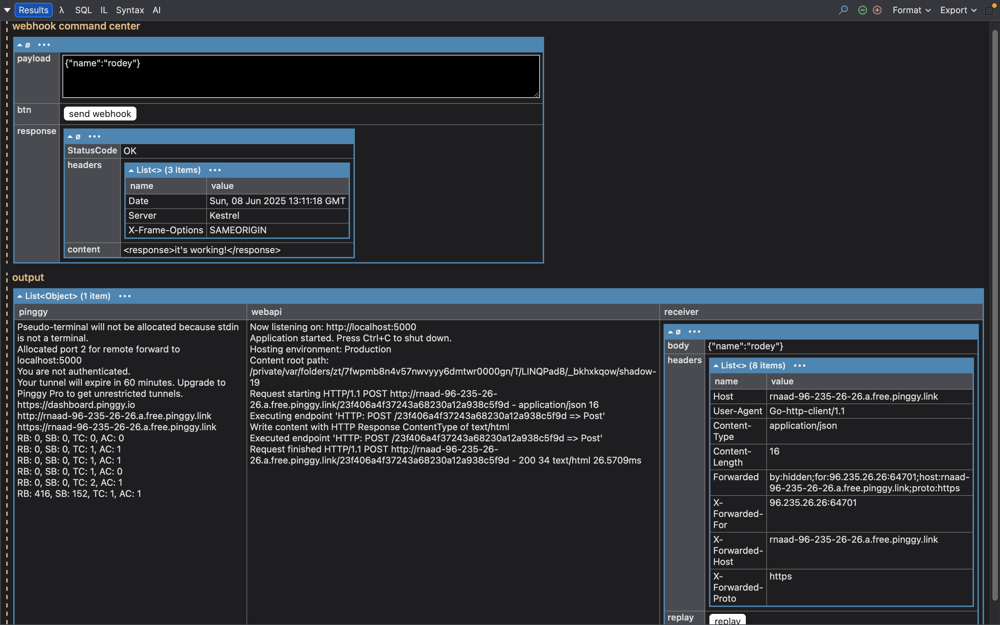

# Self-Hosted Webhooks Receiver

## Disclaimer

Running this script will create a connection to the public service Pinggy and your machine is exposed to the public internet while on port 5000. Avoid this script if those are terms are unacceptable.

## Instructions

1. In LINQPad 8 (or newer), open the `main.linq` file.
2. Run the script!
   1. Click the green Play button.
   1. On Windows, press F5.
   1. On macOS, press Command+R.

## How It Works

1. Create an ASP.NET Core Minimal API.
2. Open a connection to Pinggy. Pinggy will proxy a public web address to our little service running on `http://localhost:5000`. We get a different address with every new connection but our script will always find it.
3. The Results window shows controls to interact with the tools.

## Webhooks Command Center

Use this to tweak the data we'll send.

## output

Three columns of data based on the various sources.

### pinggy

Messages from the Pinggy terminal.

### webapi

Messages from our ASP.NET Core Minimal API.

### receiver

Incoming messages from webhooks.

## Preview

